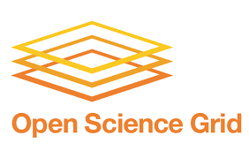

|CyVerse logo|_

|OSG logo|_

|Home_Icon|_
`Learning Center Home <http://learning.cyverse.org/>`_

**About**
---------

RMTA is a wrapper script built on top of several publicly available bioinformatic tools that can rapidly proceed from raw short read data to assembled transcripts. RMTA performs this by mapping reads using HiSat2 and then assembling transcripts using either Cufflinks or StringTie according to user preference. RMTA can process FASTQ files containing paired-end or single-end reads or can directly process one or more sequence read archives (SRA) from NCBI using SRA IDs. RMTA has been successfully used by many groups as the first step towards the identification of long-non coding RNAs using the Evolinc workflow. More information about RMTA can be found `here <https://wiki.cyverse.org/wiki/display/TUT/RMTA+v2.1>`_

The `OSG <http://www.opensciencegrid.org/>`_ is a consortium of research communities which facilitates distributed high throughput computing for scientific research. The Open Science Grid (OSG) enables distributed computing at more than 120 institutions, supports efficient data processing and provides large-scale scientific computing of more than 2 million CPU hours per day. More about OSG can be found `here <https://docs.google.com/presentation/d/1QGNxBXFcFJ4SkP3nhywtpYRx8kC0C6j5NTP_ZuVx4Qw/edit?usp=sharing>`_

OSG-RMTA (read mapping, transcript assembly), is a gene quantification workflow for RNA-Seq data utilizing CyVerse’s Discovery Environment HT-Condor for job submission, Datastore for data management and OSG for distributed high throughput computing.

RMTA minimally requires the following input data:

	* Reference Genome (FASTA) or Hisat2 Indexed Reference Genome (in a subdirectory)
	* Reference Transcriptome (GFF3/GTF/GFF)
	* RNA-Seq reads (FASTQ) - Single end or Paired-end (compressed or uncompressed) or NCBI SRA id or multiple NCBI SRA id's (each SRA ID on a separate row in the text file).

|OSGRMTA diagram|

----

  |Home_Icon|_
  `Learning Center Home <http://learning.cyverse.org/>`_

.. |CyVerse logo| image:: ../img/cyverse_rgb.png
    :width: 500
    :height: 100    
.. _CyVerse logo: http://learning.cyverse.org/

.. _OSG logo: http://osgconnect.net/

    
.. |Home_Icon| image:: ../img/homeicon.png
    :width: 25
    :height: 25
.. _Home_Icon: http://learning.cyverse.org/
