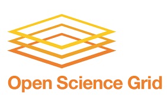

|CyVerse logo|_

|OSG logo|_

|Home_Icon|_
`Learning Center Home <http://learning.cyverse.org/>`_

OSG-RMTA 
========

This guide introduces OSG-RMTA (read mapping, transcript assembly), which is a gene quantification workflow for RNA-Seq data utilizing CyVerse’s Discovery Environment for job scheduling, Datastore for data management and OSG for distributed high throughput computing.

.. toctree::
   :maxdepth: 1
   :caption: Getting Started

   getting_started/about
   getting_started/prerequisites

.. toctree::
   :maxdepth: 1
   :caption: User Guide

   user_guide/quick-start
   user_guide/test-run

.. toctree::
   :maxdepth: 1
   :caption: Getting Help

   getting_help/faq
   getting_help/bestpractices
   getting_help/contact

..
	#### Comment:This tutorial can have multiple pages. The Table of Contents assumes
	you have an additional page called 'First Step' with content located in 'step1.rst'.
	Copy step1.rst. step2.rst has slightly different formatting to end the document.
	Edit these titles and filenames as needed ####

----

**Fix or improve this documentation**

- On Github: `Repo link <https://github.com/CyVerse-learning-materials/sciapps_guide>`_
- Send feedback: `Tutorials@CyVerse.org <Tutorials@CyVerse.org>`_

----

|Home_Icon|_
`Learning Center Home <http://learning.cyverse.org/>`_

.. |CyVerse logo| image:: ./img/cyverse_rgb.png
    :width: 500
    :height: 100
.. _CyVerse logo: http://learning.cyverse.org/

.. _OSG logo: http://osgconnect.net/

.. |Home_Icon| image:: ./img/homeicon.png
    :width: 25
    :height: 25
.. _Home_Icon: http://learning.cyverse.org/
